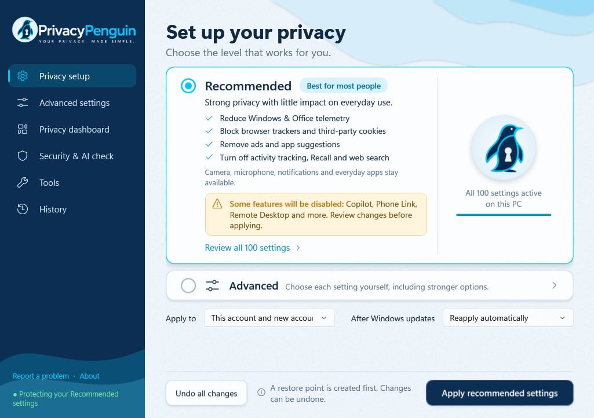

# PrivacyPenguin

**Your privacy. Made simple.**

Take control of what your PC shares. A free Windows 11 privacy tool: turn off telemetry, ads and AI features like
Recall and Copilot, harden your PC and browsers, and keep it that way after Windows updates.

- **Less tracking** — More personal privacy.
- **Fewer ads** — A calmer Windows PC.
- **Easy to undo** — You stay in control.

**Windows 11 · Free · No account needed**

> **Please note, PrivacyPenguin is not yet code-signed, so Windows SmartScreen will show a warning. You will need to
> click "More info" → "Run anyway".**
>
> On some new Windows 11 PCs, **Smart App Control** blocks unsigned apps completely, without a "Run anyway" option. If
> nothing happens or you see "Smart App Control blocked an app", PrivacyPenguin can't run on that PC
> yet; a later, signed release will.



## What it does

- **Recommended** (best for most people): strong privacy and hardening with little effect on everyday use.
- **Advanced settings:** choose each of 195 settings yourself, each with a clear note on what it changes.
- **After Windows updates:** notices when Windows switches settings back, and reminds you or restores them.
- **Privacy dashboard:** your privacy score, which apps used your camera, microphone or location, and one-click
  encrypted DNS (Quad9).
- **Undo:** every change can be undone, and a restore point is created first.

Collects nothing: no telemetry of its own, no account. For Windows 11 (64-bit); Windows 10 may work but isn't tested.

## Download and install

1. Download `PrivacyPenguin-Setup-1.1.0.exe` from the
   [latest release](https://github.com/PrivacyPenguin/PrivacyPenguin/releases/latest) (under **Assets**). Only download
   it from here: copies elsewhere may be tampered with.
2. Open the file. Windows shows **"Windows protected your PC"** because PrivacyPenguin isn't code-signed yet: click
   **More info** → **Run anyway**.
3. Click **Yes** when Windows asks whether the app may make changes (it needs administrator rights to change
   settings).
4. Follow the installer (tick **Create a desktop shortcut** if you want one), then click **Finish** to open
   PrivacyPenguin. You'll also find it in the Start menu.

**Optional – check your download:** each release lists the installer's **SHA-256 checksum**. Open PowerShell in your
Downloads folder and run:

```
Get-FileHash .\PrivacyPenguin-Setup-1.1.0.exe
```

The result must match the checksum in the release notes exactly (for another version, use its file name).

## How to use

1. **Choose your privacy level** on the **Privacy setup** page:
   - **Recommended** – best for most people. Click **Review all settings** to see the list first.
   - **Advanced** – pick each setting yourself (**Preview only** shows what would change without changing anything).
2. Choose **After Windows updates**: **Reapply automatically**, or **Ask me first**.
3. Click **Apply recommended settings** (or **Apply changes** on the Advanced page). A restore point is created first.
4. **Restart your PC** when asked, so every change takes effect.
5. Later: the **Privacy dashboard** shows your score and which apps used your camera, microphone or location, and turns
   on encrypted DNS in one click. **History** lists every change.

**To undo:** click **Undo all changes** on the Privacy setup page, or untick single settings on the Advanced page.
**To uninstall:** Windows **Settings → Apps → Installed apps → PrivacyPenguin → Uninstall**. It asks whether to undo
all of its changes first (choose **Yes** to put everything back).

## Is it safe to try?

- A **restore point** is created before changes, and **Undo all changes** puts back the original values.
- Use **Preview only** on the Advanced settings page to see exactly what would change.
- Uninstalling offers to undo everything first.

## Feedback and problems

Your feedback shapes the next versions. Report problems and ideas on the
[issues page](https://github.com/PrivacyPenguin/PrivacyPenguin/issues). For a problem, use **Report a problem** in the
app (bottom of the sidebar): it shows a support report with versions, setting states and the end of the logs, with
account and computer names already removed. Check it, save it and attach it to your issue. Issues are public, and
nothing is sent unless you attach it.

## License and privacy

PrivacyPenguin is free closed-source software (freeware). Use is governed by the [license](EULA.md); see the
[privacy policy](PRIVACY.md) for the details of "collects nothing".

*Make privacy part of your everyday.*
